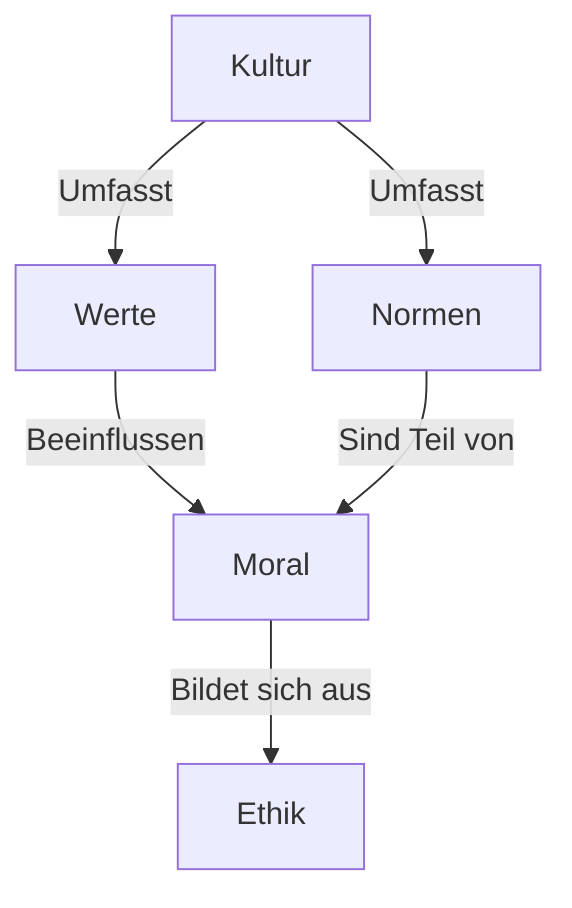
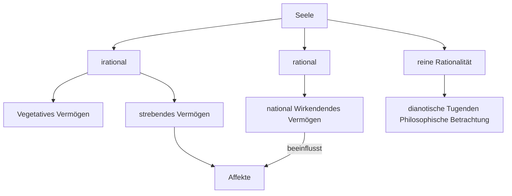

#Philosophie #Ethik 
### Verlauf der Diskussion
1. Problem erfassen
- Geschäftsmann will 10 Mio. Pfund wenn er dafür vom Premierminister zum Ritter geschlagen wird (hoher Adelstitel)

2. Handlungsmöglichkeiten diskutieren
- [ ] Bestechen lassen
- [x] nicht bestechen lassen

3. Entscheidung begründen
- Man sollte spenden ohne nach einem Titel zu fragen
- es ist eine Drohung
- 10 Mio. sind für Beide nicht viel
-  Menschenleben? 

4. Handlungsmöglichkeiten Entscheiden
- [x] Bestechen lassen und moralische bedenken haben
- [ ] nicht bestechen lassen

### Soziales Handeln/ menschliches Handeln Entscheidung für eine Handlung?
- wonach richte ich mich bei der?
- Woher weiß ich was die richtige Handlung ist?
- wer trägt die Verantwortung für eine Handlung?
- Was ist für die Entscheidung für die Beurteilung einer Handlung wichtiger Wille/Motiv oder die Folgen?
- Kann eine "schlechte" Handlung ohne negative Folgen für andere "schlecht" sein?

![[Soziales Handeln Selbstbestimmung]]

A: Werte
- Werte: Überzeugung, Haltung (Einstellung), Ideal oder Bedürfnisse
- werden auf unbestimmte zeit von Mitgliedern der Gesellschaft geteilt
- Tragen zum Charakter, Identität und Kultur bei
- moralisches, materielles, religiöses, politisches und ästhetisches
- allgemeine Zielorientierung für das Handeln
- Ehrlichkeit, Gerechtigkeit

B: Normen
- Regeln/Richtlinien Handlungsvorschriften die von der Allgemeinheit anerkannt werden
- sind verbindlich aber nicht rechtlich bindend
- unterliegen stetigen Wandel
- automatisch übernommen (muss man nicht lernen)
- du sollst jeden gleich behandeln, du sollst nicht töten

# Definition der Begriffe Ethik, Moral und Kultur

Die Begriffe Ethik, Moral und Kultur sind von zentraler Bedeutung, um einen einheitlichen Sprachgebrauch zu gewährleisten und ein tieferes Verständnis für gesellschaftliche Normen und Werte zu erlangen.

### Ethik
  - Altgriechisch "Ethos" und Latein "mos" bedeuten "Sitte" und "Gewohnheit"
  - Ethik: übergeordnete Theorie der Moral (Moralphilosophie)
  - Metaebene: betrachtet moralisches Handeln, Beurteilungskriterien, allgemein verbindliche Bedingungen für moralische Werte und Normen

### Moral
  - Beschreibt bestehendes Verhalten in einer Gesellschaft
  - Umfasst Ordnungs- und Sinngebilde durch Tradition und Konvention
  - Normen und Wertvorstellungen ordnen Bedürfnisbefriedigung und Pflichten einer Gemeinschaft an
  - Unterschiedliche Ausprägung von Moral zwischen Gesellschaften und im Laufe der Zeit

### Kultur
  - Lateinisches "cultura" von "colere" (bebauen, pflegen)
  - Umfasst alles, was der Mensch gestaltend hervorbringt
  - Einzelleistungen und Gesamtheit kultureller Beiträge einer Gemeinschaft
  - Inkludiert Umgestaltung von Mater

#### Moral vs Ethik
Moral: richtig falsch
Ethik: warum richtig falsch
# Zusammenhang in einem Schaubild

Zusammenhang zwischen den Begriffen Ethik, Moral, Kultur, Werte und Normen:

Verdeutlicht, dass Ethik die theoretische Grundlage für Moral bildet, welche wiederum von Kultur beeinflusst wird. Werte und Normen sind Bestandteile von Moral und werden von Kultur beeinflusst.
Ethik Kultur Normen Werte 

**Prinzipien** 
Einheitsstiftenende, allgemeine Grundsätze, die an erster Stelle stehen
- Alle Menschen sind gleich

**Normen**
Generalisierte Verhaltenserwartungen, Handlungsregeln (Gebote und Verbote)
- alle Schüler müssen nach dem selben Kriterien bewertet werden

**Werte**
Ideen, Leitvorstellungen und Verhaltens-wesen, die für eine Person, Gruppe wichtig und erstrebenswert sind
- Fairness
- Gerechtigkeit

Gliederung der Ethik in:

| nach Art der Behandlung ethischer Aussagen       | nach Art der Begründung ethischer Aussagen | nach Zahl der anvisierten Personen | nach Prizipien und Werten | nach Anwendungs bereichen |
| ------------------------------------------------ | ------------------------------------------ | ---------------------------------- | ------------------------- | ------------------------- |
| Desktiptive, Nominative (nicht wertend, wertend) | Theologische, Philosophische               | Individual und Sozial              | Dentologische (Handlung selbst wird Bewertet) und Teleologische (Folgen einer Handlung werden bewertet)                          |Medien, Wirtschafts und Unternehmensethik                           |

### Aristoteles Menschenbild
= ist Grundlage für seine Ethik
- Der Mensch steht an oberster Stelle und sein besonderes Kennzeichen gegenüber anderen Lebewesen und unbelebter Materie ist die Benutzung seines Verstandes.
- je nach Stufe nimmt ein Merkmal ab. (reines Dasein, Wachsen und Fortpflanzung, sinnliche Wahrnehmung, Benutzen des Verstandes)

Aristoteles betont, dass alle Menschen nach Glück streben, nach eudaimonia, und untersucht verschiedene Lebensformen, um Wege zum Glück zu identifizieren. Er kommt zu folgender Schlussfolgerung:

#### Das Leben des Genusses
- Genuss kann leicht in Üppigkeit abgleiten (immer mehr Konsum)
- Reichtum ist nur ein Mittel, kein wahres Ziel 
- Lust und Ehre könnten Ziele sein, aber ihre Echtheit ist fraglich

#### Das Leben des Politikers
- Ehre hängt von der Meinung anderer ab
- Der wahre Wert liegt in der Tüchtigkeit, aber sie allein reicht nicht aus

#### Das Leben des Philosophen
- Bietet stetige geistige Betätigung
- Der Geist hat den höchsten Wert
- Die Philosophie gewährt dauerhafte und reine Freude
- Mensch zeichnet den Verstand aus
	- höchste Form als Mensch zu leben ist den Verstand zu benutzen (Tätigkeit des Verstandes)
- zwar anstrengend aber Tätigkeit bereitet "Lust" (Freude) 
	- etwas was den Menschen auszeichnet und als Tätigkeit Lust bereitet ist für Aristoteles höchste Lebensform
Begründung:
Aristoteles argumentiert, dass das Leben des Philosophen das höchste Potenzial für ein glückliches Leben bietet, da es die größte geistige Befriedigung und Kontinuität ermöglicht.

![[Aristoteles' Konzept des Glücklichen Lebens]]

Aristoteles betont in seinem philosophischen Werk "Nikomachische Ethik" die allgegenwärtige menschliche Sehnsucht nach Glück, die er als "eudaimonia" bezeichnet. In diesem Kontext untersucht er verschiedene Lebensformen, um Wege zum Glück zu identifizieren.

Aristoteles beobachtet, dass die Mehrheit der Menschen, insbesondere die grobschlächtigen Naturen, das Leben des Genusses wählt. Er kritisiert diese Wahl und bemerkt, dass diejenigen, die sich dem Genuss hingeben, ein animalisches Dasein führen. Dabei betont Aristoteles, dass Reichtum nicht das wahre Ziel ist, sondern lediglich ein Mittel für andere Zwecke. Er zweifelt an der Authentizität von Lust und Ehre als Endzielen.

Des Weiteren stellt Aristoteles fest, dass edle und aktive Naturen das Streben nach Ehre im Dienst des Staates bevorzugen. Dabei reflektiert er darüber, dass Ehre von anderen verliehen wird und nicht zwangsläufig das eigene Selbstwertgefühl widerspiegelt. Aristoteles vermutet, dass Menschen nach Ehre streben, um ihren eigenen Wert zu bestätigen. Er deutet an, dass Tüchtigkeit das eigentliche Ziel sein könnte, betont jedoch, dass dies allein nicht ausreicht.

Schließlich führt Aristoteles die dritte Lebensform ein, die Hingabe an die Philosophie. Er argumentiert, dass der Geist und geistige Betätigung den höchsten Wert haben und die Philosophie die stetigste geistige Betätigung bietet. Aristoteles behauptet, dass Glück mit Lust verbunden sein muss, und die philosophische Tätigkeit äußerst befriedigend ist. Dabei betont er, dass die Philosophie durch ihre Reinheit und Dauer großartige Freude bietet und daher das höchste Potenzial für ein glückliches Leben darstellt.

Insgesamt schließt Aristoteles, dass das Leben des Philosophen das höchste Potenzial für ein glückliches Leben bietet, da es die größte geistige Befriedigung und Kontinuität ermöglicht, im Gegensatz zu anderen Lebensformen wie dem Leben des Genusses oder dem Leben des Politikers.

Aufbau der Seele
Seele (psyche)

Immanuel Kant 
Gedanken ohne Anschauschauung sind leer, Anschuungen, ohne Begriffe sind blind.
Kritik Kant an der bisherigen Diskusion der erkenntnistheoretischen Positionen des Rationalismus und des Empirismus
Prozentual ist die Erkenntnis für Kant, da das Erkenntnisvermögen als Struktur der Welt zu verstehen ist.