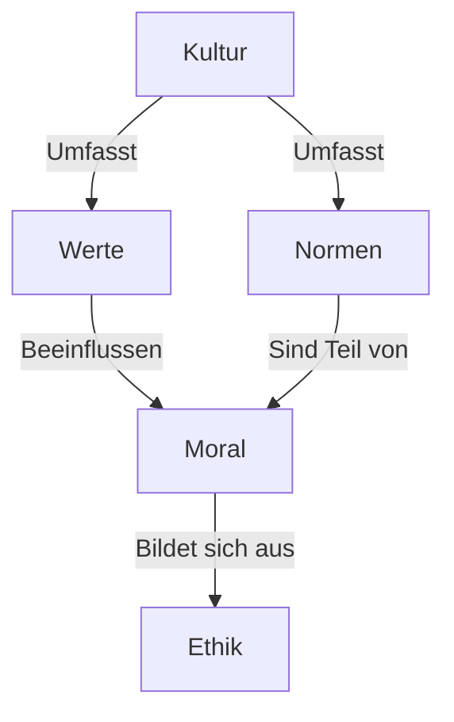
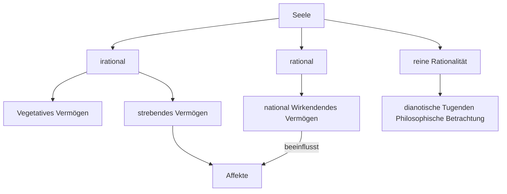

#Philosophie #Ethik 
_Was ist Philosophie?_

  

Philo

Freund/Liebe der/ zur

sophie

Weisheit/Wahrheit

  

Wissenschaft Dinge zu hinterfragen, Probleme zu erkennen und Lösungen zu finden

Kulturtechnik: philosophieren so wie auch lesen und schreiben

  

Bereiche der Philosophie nach Immanuel Kant

1. Was soll ich tun? - Ethik
    
2. Was kann ich wissen? - Erkenntnistheorie/Metaphysik
    
3. Was ist der Mensch? - Anthropologie
    
4. Was darf ich hoffen? - Religion / Metaphysik
    

  

1. Eine Oma oder ein Kind umfahren?, darf ich lügen?

2. Gibt es einen Verursacher von allem?, Was ist Wissen, Wie kommen wir zu Wissen, Wie wirklich ist die Wirklichkeit, Ist das Real?

3. Was macht den Menschen zum Menschen?

4. Hoffen auf leben nach dem Tod

  

Was sind philosophische Fragen?

- Alltagsfragen
    
    - hat sich jeder schon gestellt
        
    - sind leicht zu beantworten
        
    - haben praktischen Nutzen
        
    - z.B. Was esse ich heute?
        
- wissenschaftliche Fragen
    
    - gehen aus der wissenschaftlichen Arbeit hervor
        
    - sind durch Experimente klar zu beantworten
        
    - z.B. Wie schnell fällt ein Objekt zu Boden?
        
- philosophische Fragen
    
    - gehen aus alltäglichen Beobachtungen hervor
        
    - sind nicht eindeutig zu beantworten
        
    - bieten die Möglichkeiten zum Weiterdenken
        
    - z.B. Was ist Wissen?
        

_Wie entstand die Welt?_

  

Vom Mythos zum Logos (rationale Welterklärung)

  

Wie ist die Welt entstanden? - Erklärungsversuche in Schöpfungsmythen:

  

_Die Vorstellung der Yoruba in Ostafrika_

  

Z.1-6 Der Auftrag

6-10 Die Welterschaffung

10-11 Die Stadt Ife

11-15 Obatalas und Oduduas Kampf

15-Ende Der Kompromis

Olorun Bestitzer des Himmles

  

Obatala bekommt auftrag → wird drunk und verliert auftrag → Oduduas bekommt den Auftrag

→ führt den Auftrag aus und wird Herrscher von Ife. → Obatala wacht wieder auf und wird wütend → beginnt kampf mit Oduduas → Kompromiss Odudua bleit König, Obatala erschaft Menschen aus ton, Olorun haucht Menschen leben ein

  

  

  

_Die Vorstellung aus der Antike_

  

- Chaos
    

Existierte Chaous

Götter Gaja?

  

- Licht
    

  

- Entstehung der Erde
    

  

Gaja erschuf Erde

  

- Bevölkerung
    

Tiere

Prometeus erschaft menschen aus lehm  
Athen gibt menschen eine Seele

  

_Die Vorstellung der Inuit_

  

Alles viel vom Himmel. Feuer einzige Lichtquelle, Menschenbabys aus der Erde, Erde wird überfüllt,

frau wünscht sich den tot um Licht zu bekommen oder so.

  

_Die Vorstellung der nordgermanischen Stämme_

  

Erst war Nix

dann kam eine Person der nordische Eisriese

Er erschaft Weltenbaum

9 Welten(Marvel)

Odin und 2 andere Entwickeln konzept der Zeit/erschaffen Tageszeiten

Erschaffen aus Bäumen Menschen

Ludor und Mölmir geben Menschen Seele

  

_Die Vorstellung der Indianer aus Brasilien_

Am Anfang gab es den Großen Geist

Wollte nicht mehr alleine Sein, erschuf seine Frau aus Muschel

bekamen 2 kids, Sonne und Mond

der Große Geist schaffte auch noch Tiere Menschen etc.

Weil Menschen traurig wenn jemand stirbt erschuf er was womit Tote wieder lebendig werden, Menschen haben aber gelauscht und der große Geist nahm es ihnen dann wieder ab

  

_Die Vorstellung der_ _Aboriginis_

Herr des Himmels mit Emubeinen und blondem Haar

erschuf Menschen auf die er aufpasste, er verlor sie

Menschen konnten nur im Traum mit ihm reden

er erklärte ihnen wie die Welt entstand

  

_Kritik am Mythos_

→ Keine rationale Erklärung der Welt

→ Jeder Mythos erhebt den Anspruch wahr zu sein

→ viele verschiedene Wahrheiten

  

  

  

1

Rekonstruieren

Wiederaufbau

Argumentationsweg nachvollziehen

Einleitung:

- Thema, These, Autor, Woher, Titel, wo veröffentlicht
    
- Kentnisse: Hauptaussage des Texts, was ist die Position des Autors
    

Hauptteil:

- Wie kommt der Autor zu dieser Position
    
- Sprachliche Distanz zum Text , (performative Verben und Konjunktiv benutzen
    
- Abschnitt für Abschnitt
    

Schluss:

- Nicht werten, keine eigene Meinung
    
- Rückbezug zur Kernthese
    

  

2

Analyse, Vergleich

Einleitung:

- Hinführung zum Thema
    

Hauptteil:

- Darlegung der Vergleichstheorie (gelernte Theorie aus dem Unterricht)
    
- Bezug der Vergleichstheorie mit der Theorie aus der Klausur
    
- Vergleich erfolgt anhand geigneter Kriterien
    
    - Zeilenangaben als Beleg
        

Schluss:

- Analyseergebnis
    
    - Nicht zu allgemein formulieeren
        
    - eher als Zusammenfassung
        

  

3

Beurteilen, Reflexion

Einleitung:

- Thema mit eigenen Worten wiedergeben
    
- eigene Position
    

Hauptteil:

- Argumentation
    
    - für ihre Position (Behauptung, Erklärung,Beispiel)
        
    - gegen ihre Position Einwand
        
    - für ihre Position - Entkräften
        

Schluss:

- abschließende/zusammenfassende Position
    

  

_Erörtern_

Einleitung:

- thematische Hinführung
    
- Einordnung der Fragestellung/des Problems im philosophischen Kontext
    
- Darstellung des Problems/der Fragestellung
    
- eigene Position
    

Haptteil:

- Argumentation(Sanduhr oder Ping-Pong)
    

_Antropologie- Was ist der Mensch?_

  

_Wie ist die Natur des Menschen?_

  

Naturzustandsüberlegungen

1. Thomas Hobbes

  

_Wie ist der Mensch von Natur aus?_

In einem _**staatenlosen Zustand**_ (Ohne Regeln mit dem _**Recht auf Alles**_) ist der Mensch _**ergoistisch**_ und lebt in einem _**Krieg aller gegen**_ _alle._ Weil Menschen _**Triebe**_ haben, wie

- Überlebens/Selbsterhaltungstrieb,
    

- Ruhmsucht,
    
- Missgunst,
    
- Gewinn,
    
- Gleichheit der Hoffnung (auf ein und demselben Gegenschafft (Klauen)),
    
- und Gleichheit der Fähigkeiten (körperlich wie geistlich).
    
- deswegen keine Sicherheit, sondern ständige Gefahr um Besitz und Leben,
    
- dadurch kein Fortschritt
    

  

  

Rekonstrution

- Autor
    
- Thema
    
- Kernaussage
    
- Argumentationsweg
    

  

Der Naturzustand der Menschen, darum geht es in dem Text “Der Naturzustand” von Jean-Jacques Rousseau und in den Zitaten von Jean-Jacques Rousseau, die von dem Verlag “Deutscher Taschenbuch Verlag” im Jahr 1981 veröffentlicht wurden, wird die Frage “Wie der Mensch von Natur aus ist?” neu aufgegriffen. Die These des Authors ist, dass der Mensch von Natur aus nicht böse ist.

  

Der Author stützt seine These damit, dass der Mensch keine Art von sozialer Beziehung noch bewusster Verpflichtungen besaß und es deswegen offensichtlich ist, dass sie weder gut noch Schlecht zu sein vermochten und weder Tugenden noch Laster hätten besäßen können. Der Mensch könne gar nicht böse sein, da der Mensch garnicht weiß, dass er seine Fähigkeiten missbrauchen kann. Als nächstes sagt der Autor, dass sie mehr auf den Schutz vor ihnen drohendem Übel sind, als auf streit aus sind.

  

  

  

Jean Jacques Rousseau – Natur des Menschen

  

- Gedankenexperiment als Vorstellung eines natürlichen zustands in dem der Mensch lebt (ohne Gesetze)
    
    - Wie ist der Mensch im Naturzustand?
        

  

Antwort: Friedlich, gut und besitzt Fähigkeit zum Mitleid

Begründung:

- Menschen würden frei, gesund gut und glücklich leben wenn sie sich nur um sich selbst kümmern würden.
    
- Naturzustand ungleich Vernunftszustand
    
    - Mensch kennt keine Unterscheidung zwischen gut und böse
        
- im Naturzustand lebt der Mensch als Einzelgänger autark, wild (wie ein Tier), Selbsterhaltungsinteresse.
    
- Mitleid im Sinne von mitfühlen → verhindert, dass der Mensch anderen Lebewesen Schaden hinzufügen möchte.
    

Problem:

Menschen tredden aufeinander und entdecken den Vorteil der Zusammenarbeit (Vernunft)

→ Vergesellschaftung

→ Vernunftzustand

→ Eigentum, Eigenliebe, Eigennutz

→ kein Fortschritt, Not und Elend

Mensch hat sich durch die Kultur von einer eigentlichen Natur entfernt

  

Hobbes

Menschen haben Mitleid

Naturvs vernunftzustand?

1. Mensch ist von natur aus ein Tier

2. Mensch hat vlt. Keine Instinkte aber eignet sich instinkte an und kann so leichter überleben als andere Tiere

3.

  

  

Vergleiche Gemeinsamkeiten und Unterschiede

|   |   |
|---|---|
 
|Gemeinsamkeiten|Unterschiede|
|Hier wie dort weist der fundamentale Wille zur Selbsterhaltung den Weg zum Frieden, drängt die Furcht vor wechselseitiger Vernichtung in die schützende Burg der Staatlichkeit.|Hobbes denkt das alle Menschen böse sind und Jean Jacques Rousseau denkt das alle Menschen im Naturzustand gut sind|
|Verweilen in diesem Zustand, aus verschiedenen Gründen, nicht möglich ist und dass ein geregeltes Mit- einander der Wohlfahrt und Sicherheit aller am besten diene|Hobbes „Freiheit“ des Menschen beschränkt sich auf das „Recht auf alles“, welches in erster Linie für die Erhaltung des eigenen Lebens einzusetzen ist. Im Gegensatz hierzu lebt und genießt Rousseaus Urmensch anfangs un- gestört die Freiheit des friedlichen Lebens.|
|Ziel ist der Frieden und Sicherheit. An das Erreichen dieser Ziele ist deshalb die Legitimität der staatlichen Herrschaft gebunden.||
|Beide machen eine Naturzustandsüberlegung  Eine Natur des Menschen ist festellbar  Vorstellung über einen Naturzustand  instinktgeprägt, kein Fortschritt||
|Naturzustand = Nicht staatlicher Zustand||

Gemeinsam ist den beiden Theoretikern, dass sie von einem vorstaatlichen, vorrechtlichen Zustand ausgehen, in dem jeder für sich lebt und nur für sich sorgen muss. Der daraufhin von allen mit allen geschlossene Vertrag steht am Beginn einer sich an seinen Zielen ausrich- tenden Staatlichkeit. Die Mittel der verschiedenen Gesellschaftsverträge variieren zwar von Denker zu Denker erheblich, beiden gemeinsam ist jedoch das Ziel des Friedens und der Sicherheit. An das Erreichen dieser Ziele ist deshalb die Legitimität der staatlichen Herrschaft gebunden.

  

Hobbes: Naturzustand = Zustand der absoluten Freiheit | Gleiche Stärke egoistisch Kriegerisch böse

durch Missgunst Neid Konkurenzkampf Ungunst Instinktgeleitet

  

Rousseau tierischer/wilder Zustand bei denen natürliche Gesetze gelten | Mensch ist gut, hat fähigkeit zum Mitleiden, naiv, sanft, alleine, friedlich durch Mitleid, kann nicht zwischen gut/böse unterscheiden,

in Gesellschaft kommen negative Sachen hinzu

Mensch erkennt Fortschritt durch Zusammenarbeit,

  

Beide können Natur des Menschen feststellen

Hobbes: Menschen sind schon immer Zivilisiert

Rousseau: Mensch wurde erst Zivilisiert

  

V ergleiche Gemeinsamkeiten und Unterschiede

  

_Kritik an Naturzustandüberlegungen_

- Annahme des Menschen als Einzelgänger wiederspricht wissenschaftlichen Ergebnissen (Biologie/Evolution, Geschichte)
    
- Formulierung der Überlegung vor dem jeweiligen Hintergrund der Entstehungszeit
    
    - Denken wird davon beeinflusst
        
- feststellbare “Natur” des Menschen erscheint fraglich
    
- kulturelle Einflüsse bleiben unberücksichtigt
    
- Gedankenexperiment als Beleg für die Natur des Menschen ist ebenfalls fraglich
    

  

_Arnold Gehlen_:

- Von Natur aus ist der Mensch auf die Kultur angewiesen
    

- Mensch als Kulturmensch (Antwort)
    

  

_Arnold Gehlen: Mensch als Mangelwesen_

  

• Unspezialisiertheit

◦ organisch mittellos (keine Angriffs/Verteidigungs/Fluchtorgane)

◦ nicht besonders leistungsfähig

◦ kein Haarkleid

◦ -> Sonderstellung in der Natur als Mängelwesen und Lernwesen

• Rückgebildete Instinkte

• Mensch ist zu früh geborenes Wesen (Ein Jahr unterentwickelt), als Lernjahr

◦ (Kleinkinder unglaublich lernfähig)

• Mensch passt sich durch Nachdenken an, eignet sich Techniken an, schaut voraus

◦ Schafft eigene Kultursphäre

◦ Tiere agieren bewusstlos

• Es gibt keine kulturlosen Menschen

• Mensch schafft sich selbst

• Menschliche Entwicklung nur durch sein Wissen beschränkt

• Mensch gleicht Mängel durch künstlich geschaffene Welt aus (Kultursphäre)

• Mensch zum Kulturschaffer gezwungen

  

_Begründung:_

- Unfähigkeit von Natur aus zu überleben, da Mensch ein Mängelwesen ist
    
- Mängel:
    
    - unangepasst und nicht spezialisiert wie Tiere
        
    - organisch mittellos
        
    - Instinktreduziert
        
- Mensch ist zum überleben auf die Bea rbeitung der Natur angewiesen, so entsteht eine “zweite Natur” = Kultur I.s. einer künstlich geschaffenen Umwelt
    

_Inwiefern kann man die Theorie von Arnold Gehlen über den Menschen als Kompensationstheorie bezeichen?_

Kulur als Kompensation (Ausgleich) der Mengen des Menschen die ihm als “natürliches” Wesen nicht überleben lassen

  

Kultur: herstellen einer zweiten Natur → Natur muss bearbeitet werden

- Werkzeuge, Waffen, Fellersatz etc. (organischer Mangelsatz)
    
- von Natur ist der Mensch ein auf Gemeinschaft angewiesenes Wesen ABER von Natur aus würde der Mensch ohne Kultur (Intitutionen) überleben können
    
- Institutionen kompensieren die **unberechenbare** Natur des Menschen (diese macht ihm nicht gesellschaftsfähig)
    
- Mensch wird durch Institutionen entlastet und so bleibt Platz für Fortschritt
    

Der Mensch lebt, stirbt, atmet, verdaut, schläft und hat andere Natürliche Triebe wie Tiere.

Doch all diese Dinge kultiviert der Mensch, so bereitet er sein Essen zu und kann seine Begierde der Befriedigung hinhalten.

Außerdem erforscht und philosphiert er sein eigens darsein.

  

Löwith argumentiert, dass der Mensch von Natur aus dazu neigt, sich von der Natur abzugrenzen und eine eigene Identität zu schaffen. Dieser Prozess der Distanzierung und Selbstfindung findet seinen Ausdruck in der Kultur, die der Mensch schafft. Löwith betont, dass die Kultur nicht einfach eine bloße Anhäufung von Gegenständen oder Traditionen ist, sondern ein Ausdruck der menschlichen Fähigkeit, sich selbst zu reflektieren und die Welt um sich herum zu interpretieren.

  

Löwith argumentiert auch, dass die Kultur ein wesentlicher Bestandteil des menschlichen Lebens ist, da sie es ermöglicht, die natürlichen Instinkte des Menschen zu überwinden und ein höheres Niveau der Selbstkontrolle zu erreichen. Er verweist darauf, dass der Mensch zwar von Natur aus essen muss, aber er tut dies auf eine andere Weise als Tiere, indem er sein Essen zubereitet, ritualisiert und sogar mehr isst als er braucht. Löwith argumentiert, dass die Kultur es dem Menschen ermöglicht, seine natürlichen Triebe zu überwinden und eine höhere Form der Selbstbeherrschung zu erreichen.

  

Ein weiteres Beispiel, das Löwith anführt, ist die Art und Weise, wie der Mensch sexuelle Triebe ausdrückt. Während Tiere ihre Triebe impulsiv und instinktiv ausleben, hat der Mensch durch die Kultur die Fähigkeit entwickelt, diese Triebe zu ritualisieren und zu kanalisieren. Dieser Prozess der Distanzierung und Selbstkontrolle wird in der Kultur zum Ausdruck gebracht, die der Mensch schafft, um seine Sexualität auszudrücken.

  

Löwith betont auch, dass die Kultur ein wesentliclicher Bestandteil des menschlichen Lebens ist, da sie es ermöglicht, die natürlichen Instinkte des Menschen zu überwinden und ein höheres Niveau der Selbstkontrolle zu erreichen. Er verweist darauf, dass der Mensch zwar von Natur aus Todesängste hat, aber die Kultur gibt ihm die Möglichkeit, diese Ängste zu überwinden und ein höheres Niveau der Spiritualität und des Glaubens zu erreichen.

  

Löwiths Theorie der Kultur als Ausdruck der Fähigkeit des Menschen zur Distanzierung ist von großer Bedeutung für die Philosophie und Anthropologie. Es ermöglicht eine tiefere Verständnis dafür, wie der Mensch die Welt um sich herum interpretiert und wie die Kultur ihm ermöglicht, sich von der Natur abzugrenzen und ein höheres Niveau der Selbstkontrolle und Selbstreflexion zu erreichen. Es unterstreicht auch die Bedeutung der Kultur für das menschliche Leben und die Rolle, die sie in der Entwicklung des menschlichen Bewusstseins und der menschlichen Identität spielt.

  

These:

Im Werk "Macht und Gewalt" welcher 1970 vom Piper Verlag veröffentlicht wurde, legt Hannah Arendt eine Analyse der Begriffe Macht und Gewalt vor. Sie untersucht die gegenseitige Beziehung dieser Begriffe. Arendt definiert Macht und Gewalt unterschiedlich und betrachtet sie sogar als Gegensätze.

  

Arendt geht davon aus, dass Gewalt nicht die Vorbedingung von Macht ist. Sie argumentiert, dass Macht und Gewalt Gegensätze sind, obwohl sie oft in Kombination auftreten. Arendt betont, dass Macht durch die Abgrenzung von Gewalt entsteht. Sie argumentiert, dass Macht durch die Schaffung von Beziehungen und die Bildung von Gruppen entsteht.

  

In Bezug auf Gewalt betont Arendt, dass Gewalt lediglich ein Mittel zur Durchsetzung von Macht ist und dass sie keine Macht an sich ist. Sie argumentiert, dass Gewalt lediglich eine Zerstörung von Macht darstellt und dass sie keine wirkliche Macht erlangen kann. Arendt betont, dass Gewalt lediglich ein Mittel der Ohnmacht ist und dass sie nicht als legitimes Mittel der Machterlangung betrachtet werden sollte.

  

Arendt sieht den Unterschied zwischen Gewalt und Macht darin, dass erstere Werkzeuge zur Erreichung politischer Ziele erfordere, während Macht die Fähigkeit ist, diese Ziele durch Zusammenarbeit zu erreichen. Sie hält die Mittel, die zur Erreichung politischer Ziele eingesetzt werden, für erheblich bedeutsamer als die jeweiligen Zwecke.

  

Der Mensch – das arbeitende Wesen.

Arbeit ist körperliche oder geistige Tätigkeit mit Ziel oder Absicht, ausgeführt freiwillig oder verpflichtend, erfordert Anstrengung.

  

  

Karl Marx Die Selbstschaffung des Menschen durch Arbeit

Antwort:Mensch erschafft sich durch Arbeit selbst

Begründung: Mensch fängt an sich von Tier zu unterscheiden wenn er anfängt seine eigenen Lebensmittel zu produzieren/zu arbeiten

  

Hannah Ahrendt: Handeln als wesentliches Element der Kultur

Antwort: Hannah Arendt argumentiert, dass Handeln eine grundlegende Tätigkeit der menschlichen Lebensweise ist. Sie definiert drei grundlegende Tätigkeiten des "Vita activa": Arbeit, Herstellung und Handeln. Arbeit bezieht sich auf die Erfüllung von biologischen Bedürfnissen, Herstellung auf die Produktion von Gegenständen und Handeln auf die Kommunikation und Zusammenarbeit von Menschen. Arendt betont, dass Handeln ohne die Vermittlung von Materie, Material und Dingen direkt zwischen Menschen stattfindet und durch die Einzigartigkeit jedes Individuums ermöglicht wird.

- Handeln zeigt sich in der arbeit (zum Überleben) notwendig
    
- aus der Arbeit entsteht Kultur
    
- Mensch unterscheidet sich durch Kommunikation/Sprache von den Tieren
    

  

Karl Marx – Was ist der Mensch?

Der Mensch ist Kulturmensch und ein auf Arbeit angewiesenes Wesen.

Begründung: Selbstverwirklichung durch Arbeit

Selbstschaffung durch arbeit

Menschwerdung

das Produkt der Abreit und Arbeiten selbst(als Tätigkeit) kennzeichnet den Menschen

  

des Problems der entfremdeten Arbeit

Formen der Entfremdung:

vom Produkt seiner Arbeit

von der produktiven Tätigkeit

  

Kapitalismus führt zur Spaltung der Gesellschaft in zwei Klassen (Arbeiter/Unternehmer)

Arbeiter != Mensch

da Unternehmer Kapital anhäufen auf Kosten der Arbeiter und deren Arbeit

Lösung: Re.. durch Arbeiterklasse  
Kommunismus -> Produkto

  

_Der Mensch als freies selbstbestimmendes Wesen_

Willensfreiheit – Illusion ider Wirklichkeit

Assoziation zum Problem der Willensfreihit

Hier kommt eigentlich ne Mindmap zu Freiheit### Verlauf der Diskussion
1. Problem erfassen
- Geschäftsmann will 10 Mio. Pfund wenn er dafür vom Premierminister zum Ritter geschlagen wird (hoher Adelstitel)

2. Handlungsmöglichkeiten diskutieren
- [ ] Bestechen lassen
- [x] nicht bestechen lassen

3. Entscheidung begründen
- Man sollte spenden ohne nach einem Titel zu fragen
- es ist eine Drohung
- 10 Mio. sind für Beide nicht viel
-  Menschenleben? 

4. Handlungsmöglichkeiten Entscheiden
- [x] Bestechen lassen und moralische bedenken haben
- [ ] nicht bestechen lassen

### Soziales Handeln/ menschliches Handeln Entscheidung für eine Handlung?
- wonach richte ich mich bei der?
- Woher weiß ich was die richtige Handlung ist?
- wer trägt die Verantwortung für eine Handlung?
- Was ist für die Entscheidung für die Beurteilung einer Handlung wichtiger Wille/Motiv oder die Folgen?
- Kann eine "schlechte" Handlung ohne negative Folgen für andere "schlecht" sein?

![[Soziales Handeln Selbstbestimmung]]

A: Werte
- Werte: Überzeugung, Haltung (Einstellung), Ideal oder Bedürfnisse
- werden auf unbestimmte zeit von Mitgliedern der Gesellschaft geteilt
- Tragen zum Charakter, Identität und Kultur bei
- moralisches, materielles, religiöses, politisches und ästhetisches
- allgemeine Zielorientierung für das Handeln
- Ehrlichkeit, Gerechtigkeit

B: Normen
- Regeln/Richtlinien Handlungsvorschriften die von der Allgemeinheit anerkannt werden
- sind verbindlich aber nicht rechtlich bindend
- unterliegen stetigen Wandel
- automatisch übernommen (muss man nicht lernen)
- du sollst jeden gleich behandeln, du sollst nicht töten

# Definition der Begriffe Ethik, Moral und Kultur

Die Begriffe Ethik, Moral und Kultur sind von zentraler Bedeutung, um einen einheitlichen Sprachgebrauch zu gewährleisten und ein tieferes Verständnis für gesellschaftliche Normen und Werte zu erlangen.

### Ethik
  - Altgriechisch "Ethos" und Latein "mos" bedeuten "Sitte" und "Gewohnheit"
  - Ethik: übergeordnete Theorie der Moral (Moralphilosophie)
  - Metaebene: betrachtet moralisches Handeln, Beurteilungskriterien, allgemein verbindliche Bedingungen für moralische Werte und Normen

### Moral
  - Beschreibt bestehendes Verhalten in einer Gesellschaft
  - Umfasst Ordnungs- und Sinngebilde durch Tradition und Konvention
  - Normen und Wertvorstellungen ordnen Bedürfnisbefriedigung und Pflichten einer Gemeinschaft an
  - Unterschiedliche Ausprägung von Moral zwischen Gesellschaften und im Laufe der Zeit

### Kultur
  - Lateinisches "cultura" von "colere" (bebauen, pflegen)
  - Umfasst alles, was der Mensch gestaltend hervorbringt
  - Einzelleistungen und Gesamtheit kultureller Beiträge einer Gemeinschaft
  - Inkludiert Umgestaltung von Mater

#### Moral vs Ethik
Moral: richtig falsch
Ethik: warum richtig falsch
# Zusammenhang in einem Schaubild

Zusammenhang zwischen den Begriffen Ethik, Moral, Kultur, Werte und Normen:

Verdeutlicht, dass Ethik die theoretische Grundlage für Moral bildet, welche wiederum von Kultur beeinflusst wird. Werte und Normen sind Bestandteile von Moral und werden von Kultur beeinflusst.
Ethik Kultur Normen Werte 

**Prinzipien** 
Einheitsstiftenende, allgemeine Grundsätze, die an erster Stelle stehen
- Alle Menschen sind gleich

**Normen**
Generalisierte Verhaltenserwartungen, Handlungsregeln (Gebote und Verbote)
- alle Schüler müssen nach dem selben Kriterien bewertet werden

**Werte**
Ideen, Leitvorstellungen und Verhaltens-wesen, die für eine Person, Gruppe wichtig und erstrebenswert sind
- Fairness
- Gerechtigkeit

Gliederung der Ethik in:

| nach Art der Behandlung ethischer Aussagen       | nach Art der Begründung ethischer Aussagen | nach Zahl der anvisierten Personen | nach Prizipien und Werten | nach Anwendungs bereichen |
| ------------------------------------------------ | ------------------------------------------ | ---------------------------------- | ------------------------- | ------------------------- |
| Desktiptive, Nominative (nicht wertend, wertend) | Theologische, Philosophische               | Individual und Sozial              | Dentologische (Handlung selbst wird Bewertet) und Teleologische (Folgen einer Handlung werden bewertet)                          |Medien, Wirtschafts und Unternehmensethik                           |

### Aristoteles Menschenbild
= ist Grundlage für seine Ethik
- Der Mensch steht an oberster Stelle und sein besonderes Kennzeichen gegenüber anderen Lebewesen und unbelebter Materie ist die Benutzung seines Verstandes.
- je nach Stufe nimmt ein Merkmal ab. (reines Dasein, Wachsen und Fortpflanzung, sinnliche Wahrnehmung, Benutzen des Verstandes)

Aristoteles betont, dass alle Menschen nach Glück streben, nach eudaimonia, und untersucht verschiedene Lebensformen, um Wege zum Glück zu identifizieren. Er kommt zu folgender Schlussfolgerung:

#### Das Leben des Genusses
- Genuss kann leicht in Üppigkeit abgleiten (immer mehr Konsum)
- Reichtum ist nur ein Mittel, kein wahres Ziel 
- Lust und Ehre könnten Ziele sein, aber ihre Echtheit ist fraglich

#### Das Leben des Politikers
- Ehre hängt von der Meinung anderer ab
- Der wahre Wert liegt in der Tüchtigkeit, aber sie allein reicht nicht aus

#### Das Leben des Philosophen
- Bietet stetige geistige Betätigung
- Der Geist hat den höchsten Wert
- Die Philosophie gewährt dauerhafte und reine Freude
- Mensch zeichnet den Verstand aus
	- höchste Form als Mensch zu leben ist den Verstand zu benutzen (Tätigkeit des Verstandes)
- zwar anstrengend aber Tätigkeit bereitet "Lust" (Freude) 
	- etwas was den Menschen auszeichnet und als Tätigkeit Lust bereitet ist für Aristoteles höchste Lebensform
Begründung:
Aristoteles argumentiert, dass das Leben des Philosophen das höchste Potenzial für ein glückliches Leben bietet, da es die größte geistige Befriedigung und Kontinuität ermöglicht.

![[Aristoteles' Konzept des Glücklichen Lebens]]

Aristoteles betont in seinem philosophischen Werk "Nikomachische Ethik" die allgegenwärtige menschliche Sehnsucht nach Glück, die er als "eudaimonia" bezeichnet. In diesem Kontext untersucht er verschiedene Lebensformen, um Wege zum Glück zu identifizieren.

Aristoteles beobachtet, dass die Mehrheit der Menschen, insbesondere die grobschlächtigen Naturen, das Leben des Genusses wählt. Er kritisiert diese Wahl und bemerkt, dass diejenigen, die sich dem Genuss hingeben, ein animalisches Dasein führen. Dabei betont Aristoteles, dass Reichtum nicht das wahre Ziel ist, sondern lediglich ein Mittel für andere Zwecke. Er zweifelt an der Authentizität von Lust und Ehre als Endzielen.

Des Weiteren stellt Aristoteles fest, dass edle und aktive Naturen das Streben nach Ehre im Dienst des Staates bevorzugen. Dabei reflektiert er darüber, dass Ehre von anderen verliehen wird und nicht zwangsläufig das eigene Selbstwertgefühl widerspiegelt. Aristoteles vermutet, dass Menschen nach Ehre streben, um ihren eigenen Wert zu bestätigen. Er deutet an, dass Tüchtigkeit das eigentliche Ziel sein könnte, betont jedoch, dass dies allein nicht ausreicht.

Schließlich führt Aristoteles die dritte Lebensform ein, die Hingabe an die Philosophie. Er argumentiert, dass der Geist und geistige Betätigung den höchsten Wert haben und die Philosophie die stetigste geistige Betätigung bietet. Aristoteles behauptet, dass Glück mit Lust verbunden sein muss, und die philosophische Tätigkeit äußerst befriedigend ist. Dabei betont er, dass die Philosophie durch ihre Reinheit und Dauer großartige Freude bietet und daher das höchste Potenzial für ein glückliches Leben darstellt.

Insgesamt schließt Aristoteles, dass das Leben des Philosophen das höchste Potenzial für ein glückliches Leben bietet, da es die größte geistige Befriedigung und Kontinuität ermöglicht, im Gegensatz zu anderen Lebensformen wie dem Leben des Genusses oder dem Leben des Politikers.

Aufbau der Seele
Seele (psyche)

Immanuel Kant 
Gedanken ohne Anschauschauung sind leer, Anschuungen, ohne Begriffe sind blind.
Kritik Kant an der bisherigen Diskusion der erkenntnistheoretischen Positionen des Rationalismus und des Empirismus
transzendental ist die Erkenntnis für Kant, da das Erkenntnisvermögen als Struktur der Welt zu verstehen ist.

# Erkenntnis bei Immanuel Kant

## Zwei Hauptquellen der Erkenntnis

1. **Rezeptivität (Empfänglichkeit der Eindrücke)**:
   - Passives Empfangen von Sinneseindrücken
   - Ermöglicht Vorstellungen durch die Sinne

2. **Spontaneität des Erkenntnisvermögens**:
   - Aktives Erkennen und Verarbeiten von Vorstellungen
   - Bildung von Begriffen durch Denken

## Wichtige Punkte

- **Anschauungen (Vorstellungen)** und **Begriffe** sind beide notwendig.
  - Ohne Begriffe keine Erkenntnis aus Anschauungen
  - Ohne Anschauungen keine Anwendung von Begriffen

- **Empirische Erkenntnis**:
  - Beruht auf tatsächlichen Sinneseindrücken und Erfahrungen

- **Reine Anschauung**:
  - Form des Sehens ohne Inhalt

- **Reine Begriffe**:
  - Form des Denkens ohne Anschauung

## Zusammenspiel von Sinnlichkeit und Verstand

- **Sinnlichkeit**:
  - Aufnahme von Eindrücken durch die Sinne

- **Verstand**:
  - Verarbeitung und Strukturierung der Eindrücke

- **Wichtig**: Beide sind notwendig für Erkenntnis.
  - Sinnlichkeit ohne Verstand ist leer.
  - Verstand ohne Sinnlichkeit ist blind.

## Fazit

- Erkenntnis entsteht durch die Kombination von Sinneseindrücken und deren Verarbeitung durch das Denken.
- Beide Komponenten müssen zusammenwirken, damit Wissen entsteht.

